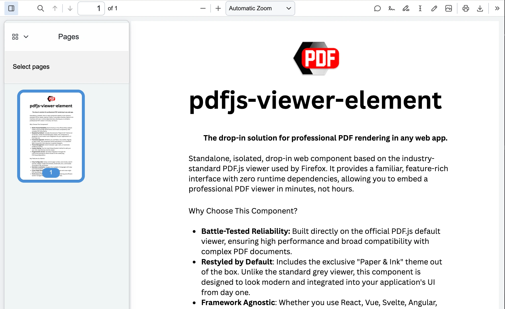

# pdfjs-viewer-element

Custom element that embeds [PDF.js default viewer](https://mozilla.github.io/pdf.js/web/viewer.html) using the `iframe`.

The package provides a custom element, based on PDF.js [viewer options](https://github.com/mozilla/pdf.js/wiki/Viewer-options) and [URL parameters](https://github.com/mozilla/pdf.js/wiki/Debugging-PDF.js#url-parameters) API. 

Supported in all [major browsers](https://caniuse.com/custom-elementsv1), and works with most [JS frameworks](https://custom-elements-everywhere.com/).

[](https://www.npmjs.com/package/pdfjs-viewer-element)
[](https://deepwiki.com/alekswebnet/pdfjs-viewer-element)
[](https://www.webcomponents.org/element/pdfjs-viewer-element)



## Features

- Standalone isolated web component with no runtime dependencies
- Drop-in, iframe-based PDF.js default viewer for any web app
- Works with same-origin and cross-origin PDF documents
- Configure via attributes and URL parameters (page, zoom, search, pagemode, locale)
- Programmatic access to `PDFViewerApplication` via the `initPromise` public property
- Theme control (automatic/light/dark) plus custom CSS injection
- Locale override support using PDF.js viewer locales
- Supports all modern browsers and most JS frameworks

## Docs

[Getting started](https://alekswebnet.github.io/pdfjs-viewer-element/)

[API playground](https://alekswebnet.github.io/pdfjs-viewer-element/#api)

[CodePen demo](https://codepen.io/redrobot753/pen/bNwVVvp)

[CodePen demo with React](https://codepen.io/redrobot753/pen/xbEwNrO)

[CodePen demo with Vue](https://codepen.io/redrobot753/pen/JoRYqwN)

[Usage examples](https://github.com/alekswebnet/pdfjs-viewer-element/tree/master/demo)

## Install

### Using module bundlers:

```bash
# With npm
npm install pdfjs-viewer-element
# With pnpm
pnpm add pdfjs-viewer-element
```

```javascript
import 'pdfjs-viewer-element'
```

### Using browser and CDN:

```html
<script type="module" src="https://cdn.jsdelivr.net/npm/pdfjs-viewer-element/dist/pdfjs-viewer-element.js"></script>
```

## Usage

```html
<pdfjs-viewer-element
  src="https://alekswebnet.github.io/sample-pdf-with-images.pdf"
  style="height: 100dvh">
</pdfjs-viewer-element>
```

The element is block-level and needs an explicit height.

### Framework usage

- [React integration example](https://codepen.io/redrobot753/pen/xbEwNrO)
- [Vue integration example](https://codepen.io/redrobot753/pen/JoRYqwN)

## Attributes

| Attribute | Description | Default |
| --- | --- | --- |
| `src` | PDF file URL. | `''` |
| `iframe-title` | Title for the internal `iframe` (recommended for accessibility). | `PDF viewer window` |
| `page` | Page number. | `''` |
| `search` | Search query text. | `''` |
| `phrase` | Phrase search mode, set to `true` to enable phrase matching. | `''` |
| `zoom` | Zoom level (for example `auto`, `page-width`, `200%`). | `''` |
| `pagemode` | Sidebar mode: `thumbs`, `bookmarks`, `attachments`, `layers`, `none`. | `none` |
| `locale` | Viewer UI locale (for example `en-US`, `de`, `uk`). [Available locales](https://github.com/mozilla/pdf.js/tree/master/l10n) | `''` |
| `locale-src-template` | Locale file URL template. Must contain `{locale}` placeholder. Used together with `locale`. | `https://cdn.jsdelivr.net/gh/mozilla-l10n/firefox-l10n@main/{locale}/toolkit/toolkit/pdfviewer/viewer.ftl` |
| `viewer-css-theme` | Viewer theme: `AUTOMATIC`, `LIGHT`, `DARK`. | `AUTOMATIC` |
| `worker-src` | PDF.js worker URL override. | `<package-url>/pdf.worker.min.mjs` |

Play with attributes on [API docs page](https://alekswebnet.github.io/pdfjs-viewer-element/#api).

## Runtime updates

Most attributes can be updated dynamically:

- `src` updates by calling PDF.js `open({ url })` without rebuilding the viewer.
- `page`, `search`, `phrase`, `zoom`, `pagemode` update via hash parameters.
- `viewer-css-theme` updates the viewer theme at runtime.
- `worker-src` updates viewer options for subsequent document loads.
- `locale` rebuilds the viewer so localization resources can be applied.

## Worker source

By default, the component resolves `worker-src` to the worker shipped with this package (`pdf.worker.min.mjs` in `dist`).

Set `worker-src` only if you want to serve the worker from a custom location (for example your own CDN or static assets path).

- The URL must point to a valid PDF.js module worker file.
- The worker version should match the bundled PDF.js version.

```html
<pdfjs-viewer-element
  src="/file.pdf"
  worker-src="https://cdn.jsdelivr.net/npm/pdfjs-dist@v5.5.207/build/pdf.worker.min.mjs">
</pdfjs-viewer-element>
```

## Locale source template

Use `locale-src-template` when you need to load localization files from a custom host.

- The template must include `{locale}`.
- `{locale}` is replaced by the `locale` attribute value (for example `de`, `uk`, `en-US`).
- If `locale` is not set, no locale file is loaded.
- Changes to `locale-src-template` are applied when the viewer is (re)initialized, for example after setting/changing `locale`.

Example:

```html
<pdfjs-viewer-element
  src="/file.pdf"
  locale="de"
  locale-src-template="https://cdn.example.com/pdfjs-locales/{locale}/viewer.ftl">
</pdfjs-viewer-element>
```

## Viewer CSS theme

Use `viewer-css-theme` attribute to set light or dark theme manually:

```html
<pdfjs-viewer-element 
  src="/file.pdf" 
  viewer-css-theme="DARK">
</pdfjs-viewer-element>
```

Runtime example:

```javascript
const viewerElement = document.querySelector('pdfjs-viewer-element')
viewerElement.setAttribute('viewer-css-theme', 'DARK')
viewerElement.setAttribute('viewer-css-theme', 'LIGHT')
viewerElement.setAttribute('viewer-css-theme', 'AUTOMATIC')
```

## Viewer custom styles

You can add your own CSS rules to the viewer application using `injectViewerStyles(styles: string)`:

```html
<pdfjs-viewer-element id="viewer" src="/file.pdf">
</pdfjs-viewer-element>
```

```javascript
const viewerElement = document.querySelector('#viewer')
viewerElement.injectViewerStyles(`
  #toolbarViewerMiddle, #toolbarViewerRight { display: none; }
`)
```

`injectViewerStyles(...)` applies styles immediately when the viewer document is ready, and keeps them for future rebuilds.

Build your own theme with viewer custom variables and inject it via `injectViewerStyles(...)`:

```css
:root {
  --main-color: #5755FE;
  --toolbar-icon-bg-color: #0200a8;
  --field-color: #5755FE;
  --separator-color: #5755FE;
  --toolbar-border-color: #5755FE;
  --field-border-color: #5755FE;
  --toolbar-bg-color: rgba(139, 147, 255, .1);
  --body-bg-color: rgba(255, 247, 252, .7);
  --button-hover-color: rgba(139, 147, 255, .1);
  --toolbar-icon-hover-bg-color: #0200a8;
  --toggled-btn-color: #0200a8;
  --toggled-btn-bg-color: rgba(139, 147, 255, .1);
  --toggled-hover-active-btn-color: #5755FE;
  --doorhanger-hover-bg-color: rgba(139, 147, 255, .1);
  --doorhanger-hover-color: #0200a8;
  --dropdown-btn-bg-color: rgba(139, 147, 255, .1);
}
```

## Methods and Public properties

Methods:

`injectViewerStyles(styles: string)` - Adds custom CSS to the viewer now (when ready) and for future rebuilds.

Example (`injectViewerStyles`):

```javascript
const viewerElement = document.querySelector('pdfjs-viewer-element')

await viewerElement.injectViewerStyles(`
  #toolbarViewerRight { display: none; }
  #findbar { border-top: 2px solid #0200a8; }
`)
```

Public properties:

`initPromise: Promise<InitializationData>` - Resolves after internal viewer is completely loaded and initialized, returning `{ viewerApp }`, that gives a programmatic access to PDF.js viewer app (PDFViewerApplication).

Example (`initPromise`):

```javascript
const viewerElement = document.querySelector('pdfjs-viewer-element')
const { viewerApp } = await viewerElement.initPromise

viewerApp.open({ url: '/sample.pdf' })
```

`iframe: PdfjsViewerElementIframe` - Public reference to the internal `iframe` element. Useful when you need direct access to `contentWindow`/`contentDocument`.

Example (`iframe`):

```javascript
const viewerElement = document.querySelector('pdfjs-viewer-element')

// Access iframe window directly when needed.
const iframeWindow = viewerElement.iframe.contentWindow

// Read current location hash applied to the viewer.
console.log(iframeWindow.location.hash)

// Inspect iframe document title.
console.log(viewerElement.iframe.contentDocument.title)
```

You can also react to source changes dynamically:

```javascript
const viewerElement = document.querySelector('pdfjs-viewer-element')
viewer.setAttribute('src', '/another-file.pdf')
```

## Accessibility

Use `iframe-title` to add a title to the `iframe` element and improve accessibility.

## License
[MIT](http://opensource.org/licenses/MIT)
