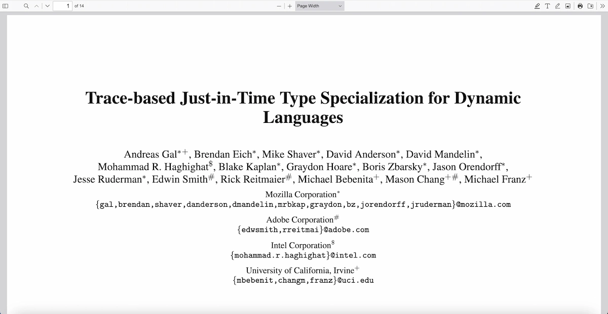

# pdfjs-viewer-element

Custom element that embeds [PDF.js default viewer](https://mozilla.github.io/pdf.js/web/viewer.html) using the `iframe`.

The package provides a custom element, based on PDF.js [viewer options](https://github.com/mozilla/pdf.js/wiki/Viewer-options) and [URL parameters](https://github.com/mozilla/pdf.js/wiki/Debugging-PDF.js#url-parameters) API. 

Supported in all [major browsers](https://caniuse.com/custom-elementsv1), and works with most [JS frameworks](https://custom-elements-everywhere.com/).

[](https://www.npmjs.com/package/pdfjs-viewer-element)
[](https://deepwiki.com/alekswebnet/pdfjs-viewer-element)
[](https://packagequality.com/#?package=pdfjs-viewer-element)
[](https://www.webcomponents.org/element/pdfjs-viewer-element)



## Features

- Simple PDF.js viewer integration to any web application
- PDF.js viewer options and parameters support, access the viewer application instance
- Customize viewer styles and themes

## Docs

[Getting started](https://alekswebnet.github.io/pdfjs-viewer-element/)

[API playground](https://alekswebnet.github.io/pdfjs-viewer-element/#api)

[Usage with frameworks](https://alekswebnet.github.io/pdfjs-viewer-element/#demo)

[Various usecases](https://github.com/alekswebnet/pdfjs-viewer-element/tree/master/demo)

## Support via Ko-fi

If you find `pdfjs-viewer-element` useful and want to support its development, consider making a donation via Ko-fi:

[](https://ko-fi.com/oleksandrshevchuk)

> ❤️ Your support helps with maintenance, bug fixes, and long-term improvements.

## How it works

**⚠️ This is an important part, please read this FIRST !!!**

 **You should download and place the PDF.js prebuilt files in the project.**

`pdfjs-viewer-element` requires [PDF.js prebuilt](http://mozilla.github.io/pdf.js/getting_started/), that includes the generic build of PDF.js and the viewer.

The prebuilt comes with each PDF.js release. [PDF.JS releases](https://github.com/mozilla/pdf.js/releases)

✅ All v3, v4 and v5 releases are fully supported.

After placing the prebuild specify the path to the directory with the `viewer-path` property (`/pdfjs` by default) and PDF file URL with `src` property (should refer to the [same origin](https://github.com/mozilla/pdf.js/wiki/Frequently-Asked-Questions#can-i-load-a-pdf-from-another-server-cross-domain-request)).

## Install

### Using module bundlers:

```bash
# With npm
npm install pdfjs-viewer-element
# With yarn
yarn add pdfjs-viewer-element
# With pnpm
pnpm add pdfjs-viewer-element
```

```javascript
import 'pdfjs-viewer-element'
```

### Using browser and CDN:

```html
<script type="module" src="https://cdn.skypack.dev/pdfjs-viewer-element"></script>
```

## Usage

```html
<pdfjs-viewer-element src="/file.pdf" viewer-path="/pdfjs-5.3.93-dist"></pdfjs-viewer-element>
```

## Attributes

`src` - PDF file URL, should refer to the [same origin](https://github.com/mozilla/pdf.js/wiki/Frequently-Asked-Questions#can-i-load-a-pdf-from-another-server-cross-domain-request) 

`viewer-path` - Path to PDF.js [prebuilt](http://mozilla.github.io/pdf.js/getting_started/)

`iframe-title` - The title of the `iframe` element, required for better accessibility

`page` - Page number.

`nameddest` -  Go to a named destination.

`search` - Search text.

`phrase` - Search by phrase, `true` to enable.

`zoom` - Zoom level.

`pagemode` - Page mode, `thumbs | bookmarks | attachments | layers | none`.

`disable-worker` - Disables the worker, `true` to enable.

`text-layer` - Disables or reveals the text layer that is used for text selection, `off | visible | shadow | hover`.

`disable-font-face` - Disables standard `@font-face` font loading and uses the internal font renderer instead, `true` to enable.

`disable-range` - Disables HTTP range requests when fetching the document, `true` to enable.

`disable-stream` - Disables streaming when fetching the document, `true` to enable.

`disable-auto-fetch`- Disables auto fetching of the document; only gets necessary data to display the current view. Note: streaming also needs to be disabled for this to have any effect, `true` to enable.

`verbosity`- Specifies the verbosity level of console messages. `0` - only errors, `1` - warnings and errors, `5` - warnings, errors and information messages.

`locale` -  Specifies which language to use in the viewer UI, `en-US | ...`. [Available locales](https://github.com/mozilla/pdf.js/tree/master/l10n)

`viewer-css-theme` - Apply automatic, light, or dark theme, `AUTOMATIC | LIGHT | DARK`

`viewer-extra-styles` - Add your CSS rules to the viewer application, pass a string with styles.

`viewer-extra-styles-urls` - Add external CSS files to the viewer application, pass an array with URLs.

Play with attributes on [Api docs page](https://alekswebnet.github.io/pdfjs-viewer-element/#api).

## Viewer CSS theme

Use `viewer-css-theme` attribute to set light or dark theme manually:

```html
<pdfjs-viewer-element 
  src="/file.pdf" 
  viewer-path="/pdfjs-5.3.93-dist"
  viewer-css-theme="DARK">
</pdfjs-viewer-element>
```

## Viewer custom styles 

You can add your own CSS rules to the viewer application using `viewer-extra-styles` or `viewer-extra-styles-urls` attribute:

```html
<pdfjs-viewer-element 
  src="/file.pdf" 
  viewer-path="/pdfjs-5.3.93-dist"
  viewer-extra-styles="#toolbarViewerMiddle { display: none; }"
  viewer-extra-styles-urls="['/demo/viewer-custom-theme.css']">
</pdfjs-viewer-element>
```
Build your own theme with viewer's custom variables and `viewer-extra-styles-urls` attribute: 

```css
:root {
  --main-color: #5755FE;
  --toolbar-icon-bg-color: #0200a8;
  --field-color: #5755FE;
  --separator-color: #5755FE;
  --toolbar-border-color: #5755FE;
  --field-border-color: #5755FE;
  --toolbar-bg-color: rgba(139, 147, 255, .1);
  --body-bg-color: rgba(255, 247, 252, .7);
  --button-hover-color: rgba(139, 147, 255, .1);
  --toolbar-icon-hover-bg-color: #0200a8;
  --toggled-btn-color: #0200a8;
  --toggled-btn-bg-color: rgba(139, 147, 255, .1);
  --toggled-hover-active-btn-color: #5755FE;
  --doorhanger-hover-bg-color: rgba(139, 147, 255, .1);
  --doorhanger-hover-color: #0200a8;
  --dropdown-btn-bg-color: rgba(139, 147, 255, .1);
}
```

## PDF.js Viewer Application

`initialize` - using this method you can access PDFViewerApplication and use methods and events of PDF.js default viewer

```html
<pdfjs-viewer-element viewer-path="/pdfjs-5.3.93-dist"></pdfjs-viewer-element>
```

```javascript
const viewer = document.querySelector('pdfjs-viewer-element')
// Wait for the viewer initialization, receive PDFViewerApplication
const viewerApp = await viewer.initialize()
// Open PDF file data using Uint8Array instead of URL
viewerApp.open({ data: pdfData })
```

## Accessiblity

Use `iframe-title` to add a title to the `iframe` element and improve accessibility.

## Known issues

### The `.mjs` files support

Since v4 PDF.js requires `.mjs` files support, make sure your server has it.

In case of `nginx` this may causes to errors, see https://github.com/mozilla/pdf.js/issues/17296

Add `.mjs` files support for `nginx` example:

```bash
server {
    # ...

    location / {
        root   /usr/share/nginx/html;
        index  index.html;

        location ~* \.mjs$ {
            types {
                text/javascript mjs;
            }
        }
    }
}
```

### Problem with range requests / streaming

Sometimes a PDF file fails to load when working with range requests / streaming.
If you encounter this issue, you can try disabling the broken functionality of PDF.js:

`disable-range="true"`


## License
[MIT](http://opensource.org/licenses/MIT)
